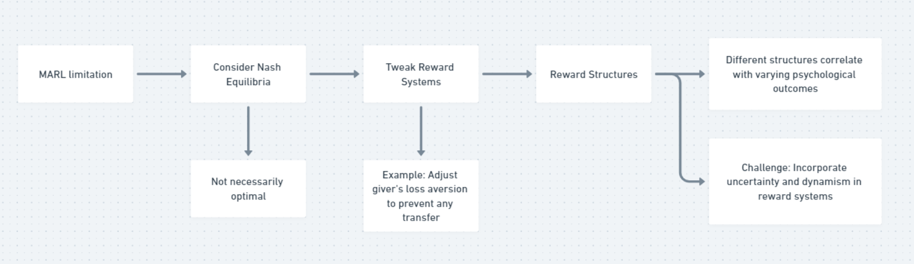

# Week 2 Reflection

**Question 1 on Beyond Computer Science and Economics Methodology 1 Behavioral Game Theory and Mechanism Design: Innovating Behavioral Game Theory Tools**

My experience using oTree in the classroom was not as smooth as I had anticipated. During the deployment phase, I encountered several issues; I was stuck trying to get oTree to run locally, which might be attributed to my unfamiliarity with terminal commands. In the actual experimentation phase, I attempted to conduct multiple rounds of the experiment with myself to fine-tune my strategies. However, I couldn't find an option that allowed for this iterative process, and I had to resort to repeatedly restarting the session to proceed. Lastly, in analyzing the experimental data, I found that oTree only provided a rudimentary data table (Figure 1), necessitating further data analysis through additional software.

For solving those pain points, I am planning to integrate a one-click environment setup feature into oTree Studio, as well as to incorporate an additional generative AI API into oTree. 
The rationale behind the one-click setup option is to facilitate ease of use for individuals without a computer science background. In our classroom practice, we spent a considerable amount of time configuring the Python environment and running oTree locally, whereas a simple deployment within oTree Studio would eliminate all these preliminary steps.

I envision the newly added Generative AI (GAI) interface to enhance the facilitation of experiments and data analysis. Addressing the scenario I mentioned, with GAI implementation, if I desire to conduct "5 rounds of testing with a trust game," I would simply input my intention, and GAI would assist in the automatic configuration of the experimental environment, which would encompass APIs executing code automatically in practice. Furthermore, after obtaining the experimental results, GAI could also aid in data analysis and interpretation of the outcomes. Figure 2 illustrates the flowchart of GAI interaction.

Fig.1 Otree data table

Fig.2 Flowchart of GAI interact with Otree

**Question 2 Beyond Computer Science and Economics Methodology 2 Multi-agent Reinforcement Learning:  Advancing Multi-Agent Reinforcement Learning**

I wish to recreate the Trust Game using Multi-Agent Reinforcement Learning (MARL). In the Trust Game, two anonymous players are endowed with a sum of money. The first player (the trustor) decides whether to send a portion or all of their money to the second player (the trustee). The transferred amount is then multiplied (typically tripled) by the experimenter, after which the second player chooses whether and how much of the multiplied sum to return to the first player (Bolton, Katok, & Zwick, 1998). To apply MARL, we need to define two agents in the environment: one representing the investor and the other the trustee. The aim of these agents is to maximize their own returns, achievable through either cooperation or non-cooperation. The state could include the current allocation of funds, previous transaction history, etc. Actions are the decisions the agents can make, such as how much the investor decides to invest and how much the trustee decides to return. The rewards are based on their decisions and could take the form of monetary returns.

My classroom experience has taught me that conventional reward settings tend to steer problems towards optimal solutions (see Fig. 2). However, in game theory problems, considerations like Nash equilibria—which might not be optimal—need to be factored in. To address this, it becomes necessary to continuously tweak the reward systems of each agent. For example, to reach a Nash equilibrium, the giver's loss aversion should be set so high that they wouldn't give any money to the second person. Inspired by this predicament, I have also come to appreciate the intricate variability in game theory research; that each reward structure we devise may correlate with a different psychological outcome in subjects. As Canese et al. (2021) pointed out, the uncertainty and dynamism of environments pose a significant challenge when applying Multi-Agent Reinforcement Learning (MARL) in the real world. Moreover, the interactions between multiple agents are non-static, meaning the actions of one agent can impact the returns of others. Consequently, we require more sophisticated MARL models to adapt to varying situations, such as the optimization models like the decision-transformer model.

Fig.3 Flowchart of MARL improvement 

**Question 3 Brainstorm your research idea by criticizing existing research: Critiquing and Expanding upon Existing Research**

**1. Summary of the Paper (Luo et al. 2023)**

Core Research Questions: The paper investigates how to design an efficient incentive mechanism for Federated Learning (FL) with partial client participation that ensures convergence to an optimal, unbiased global model.

Methodologies: The paper adopts a game-theoretic approach for the incentive mechanism, integrating a Stackelberg game model between the server and clients. The server adopts a pricing strategy to motivate client participation, while clients respond to monetary incentives.

Application Scenarios: The mechanism is evaluated using real datasets on a hardware prototype, demonstrating its effectiveness in achieving higher model performance for the server and increased profits for clients. 

**2. Critique of the Research Question**

Regarding the research question in the paper, I posit that incorporating an analysis of the computational power of different users' devices and establishing a suitable model bias strategy will make the overarching Federated Learning (FL) model more comprehensive. In the domain of IoT, we often discuss offloading and allocation issues between the cloud and mobile devices, such as in a Mobile Edge Computing system ( Yan et al. 2020). In the original article, the authors only discuss how to establish an incentive mechanism for users and the corresponding optimization algorithms but do not address how to adapt to different devices' computational capabilities. I envision that offering models of varying complexity to different devices could foster user participation and optimize outcomes to a certain extent. Additionally, regarding the unbiasedness of FL, due to the variability of the training models used, we might have to assign different weights to different outcomes in the end to accommodate them.

**3. Critique of the Methodology**

The paper mentions utilizing users' intrinsic values to construct a recommendation model, yet it omits details on how 'intrinsic value' is defined and measured. Given that this is a highly subjective variable, a precise definition would facilitate further research in the field.

**4. Critique of the Application Scenario**

The paper concludes with the implementation of the model on a network architecture comprising Raspberry Pi and Wi-Fi, applied to the public datasets MNIST and EMNIST. This setup was used to validate the optimization function's convergence and performance. However, the final training process lacked empirical validation with real-world users, casting some uncertainties on the feasibility of the proposed incentive mechanism when deployed in practical situations. Further real-world experiments are required to validate its applicability.

Looking ahead, the integration of generative artificial intelligence models within the Federated Learning (FL) framework holds the potential to pioneer new pathways for data augmentation and privacy preservation. By generating synthetic data that mimics real datasets, it could address issues related to data scarcity and privacy in sensitive applications.

**5. Beyond Computer Science and Economics**

Regarding this issue, I sought the perspective of ChatGPT 4.0, as shown in figure 5, which suggested that integrating bounded rationality—encompassing human cognitive limitations and decision-making heuristics—with a Federated Learning (FL) environment that includes multiple artificial intelligence agents such as ChatGPT could significantly impact outcomes. Human participants may display decision-making influenced by psychological heuristics, resulting in a varying response to incentives compared to a purely rational model. On the other hand, artificial intelligence agents, based on their programming, may exhibit different forms of "rationality," potentially more consistent yet lacking the intuitive judgement akin to humans. Incorporating such elements introduces more complex and potentially unpredictable dynamics into the FL model, thus necessitating the design of robust incentive mechanisms and participation strategies that cater to human cognitive traits and AI capabilities. This approach could yield more realistic models that better reflect the interactions and decision-making processes of the real world.

Fig.4 Mindmap of paper critique

# Bibliography
Association for Computing Machinery."2018 Turing Award."  https://awards.acm.org/about/2018-turing.

Brynjolfsson, Erik, Danielle Li, and Lindsey R. Raymond. Generative AI at work. No. w31161. National Bureau of Economic Research, 2023.

Horton, John J. Large language models as simulated economic agents: What can we learn from homo silicus?. No. w31122. National Bureau of Economic Research, 2023.

Kojima, Takeshi, Shixiang Shane Gu, Machel Reid, Yutaka Matsuo, and Yusuke Iwasawa. "Large language models are zero-shot reasoners." Advances in neural information processing systems 35 (2022): 22199-22213.

LeCun, Yann, Yoshua Bengio, and Geoffrey Hinton. "Deep learning." nature 521, no. 7553 (2015): 436-444.

Nobel Prize.“The Prize in Economic Sciences 2017.” https://www.nobelprize.org/prizes/economic-sciences/2017/popular-information/

Shapira, Eilam, Omer Madmon, Roi Reichart, and Moshe Tennenholtz. "Can Large Language Models Replace Economic Choice Prediction Labs?." arXiv preprint arXiv:2401.17435 (2024).

Thaler, Richard H., and Cass R. Sunstein. Nudge: Improving decisions about health, wealth, and happiness. Penguin, 2009.

# Grammaly and Turnitin

