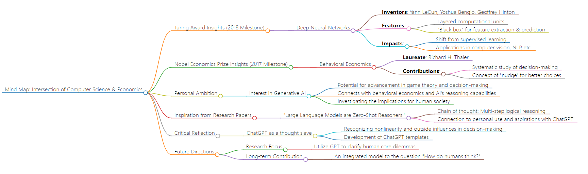
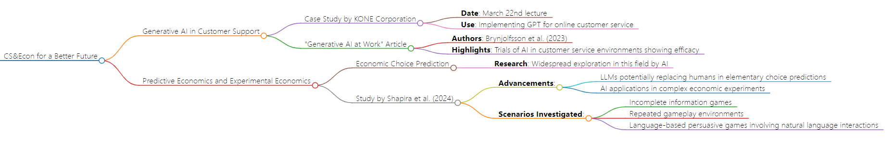
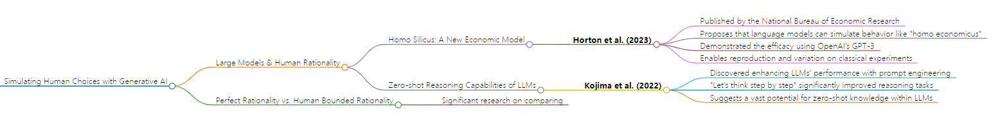
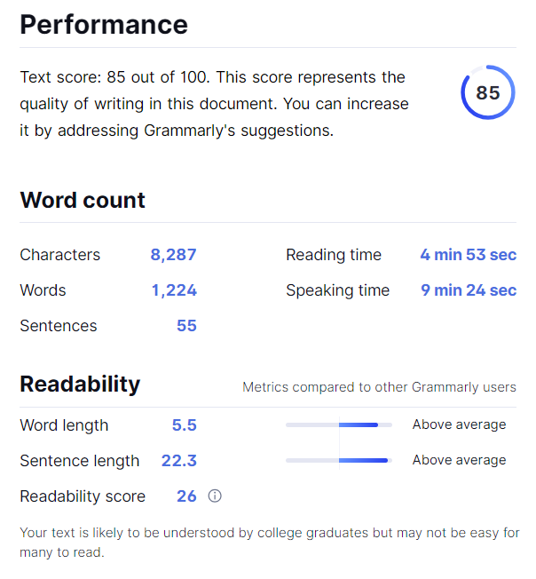

# Week 1 Reflection
## Question 1
**When computer science meets economics**: Who do you truly want to become? Pick one of your favorite Nobel Prize winners (https://www.nobelprize.org/) and Turing Award winners (https://amturing.acm.org/). How do you want to contribute to the intersection of the two north stars to advance human civilizations? 

*2018 Turing Award Milestone*: LeCun, Yann, Yoshua Bengio, and Geoffrey Hinton. "Deep learning." nature 521, no. 7553 (2015): 436-444.

Regarding the Turing Award, the winners I most admire are those from the year 2018. The 2018 laureates, Yoshua Bengio, Geoffrey Hinton, and Yann LeCun, were honored specifically for their pioneering contributions to deep neural networks ( Association for Computing Machinery 2018). The deep neural networks are a product of an age characterized by increased computational power; their core logic involves the layering of massive numbers of simple computational units to form a 'black box' designed for feature extraction and prediction tasks (LeCun et al. 2018). This approach has significantly altered our application of machine learning, shifting from a prevalent reliance on supervised learning for making predictions, to allowing for the more stochastic processing of large datasets (LeCun et al. 2018). Consequently, deep neural networks have rapidly and intensely influenced numerous associated domains, including computer vision and natural language processing, among others (LeCun et al. 2018).

*2017 Nobel Economics award milestone*: Thaler, Richard H., and Cass R. Sunstein. Nudge: Improving decisions about health, wealth, and happiness. Penguin, 2009.

For the Nobel Prize in Economic Sciences, the laureate I most admire is the 2017 winner, Richard H. Thaler, who was recognized for his outstanding contributions to the field of behavioral economics (Nobel Prize 2017). Thaler is a pioneer in this area, having conducted a systematic study of how economic actors think and make decisions (Nobel Prize 2017), and he has introduced innovative concepts such as the "nudge." (Thaler et al. 2009).

In terms of my personal views on the interdisciplinary research of computer science and economics, the study of generative AI is indeed a current popular area, and I firmly believe that this technology will eventually achieve recognition through awards like the Nobel Prize or the Turing Award. Yet evidently, it should not remain solely within the scientific domain. I assert that there is significant potential for a deep investigation into its implications for human society. I have observed that many papers in the field of economics have begun to explore how generative AI can imitate human decision-making processes and contribute to the advancement of game theory-related research. Nevertheless, there is currently a scant focus on how generative AI could revolutionize human cognitive processes and aid in a more profound self-comprehension.

My inspiration came from a paper by Takeshi and colleagues titled "Large Language Models are Zero-Shot Reasoners." (Takeshi et al. 2022). They discuss "chain of thought," a model of multi-step logical reasoning, which they used to assess the efficacy of ChatGPT. This sparked an epiphany for me due to a sudden connection I made with my own usage of ChatGPT. I had once envisaged it as a solution for all problems encountered in daily life, but my attempts ultimately met with failure. Upon reflecting on these unsuccessful endeavors, I recognized that my thought process is often nonlinear and that while analyzing issues, I could be influenced by many irrelevant factors that obscure the fundamental problem at hand. This bottleneck could be one of the reasons for ChatGPT's less-than-universal acceptance and might also explain the current surge in people investing efforts into the development of ChatGPT templates.

In closing, I regard ChatGPT as an exceptional tool without question, yet the prevailing challenge is defining its mechanism of interaction and collaboration with human thought. My initial research focus is to employ GPT as a sieve for human thoughts, assisting individuals in identifying their core dilemmas. Looking ahead, this endeavor could potentially contribute an integrated model or solutions to the intricate inquiry of "How do humans think?"

Fig.1 Mindmap of CS&Econ intersection

## Question 2
**CS&Econ for a Better Future**: How do you perceive the synergy between computer science and economics as a catalyst for steering innovation toward a brighter future? Please present a foundational assertion, followed by multiple specific instances that support your claim, including a reference to a topic discussed at the colloquium on Friday, March 22.

A potential interdisciplinary route between computer science and economics is the practical application of generative artificial intelligence, particularly in deciphering fundamental human needs and emulating human behavior. During a lecture on March 22nd, a speaker from KONE Corporation expounded on how generative AI is instrumental in resolving customer issues, using GPT as a novel tool for online customer support. This brought to mind the article "Generative AI at Work" by Brynjolfsson et al.(2023), where they trialed the application of AI customer service in a lab environment, revealing the considerable potential for AI to effectively execute these tasks.

Furthermore, generative artificial intelligence is widely researched in the area of economic choice prediction and experimental economics. According to a study by Shapira and colleagues (2024), significant recent advancements in AI have included the exploration of whether Large Language Models (LLMs) can replace humans in basic choice prediction scenarios, as well as an examination of more complex and stringent experimental economic settings through a machine learning perspective. This involves scenarios with incomplete information, repeated gameplay, and natural language interactions, especially in language-based persuasive games.

Fig.2 Mindmap of CS&Econ for better future

## Question 3
**Beyond CS & Econ**: How are aspects of human nature, like bounded rationality, and pioneering technologies, such as generative AI, reshaping the dynamics between humans and AI agents in strategic contexts? Additionally, how might this interplay be perceived and conceptualized distinctively from current models? 

As mentioned by Shapira et al. (2024), current research regarding large models in human rationality focuses in part on whether large models can simulate human choices. There has been considerable research by many scholars on similar questions.

Recently, Horton et al.(2023), through a working paper from the National Bureau of Economic Research, proposed that large language models, as implicit computational models—dubbed homo silicus—can be used in a manner akin to economic models known as homo economicus. These models can simulate behavior in various scenarios. Utilizing OpenAI's GPT-3 and comparing with classical experiments, Horton demonstrated that this method can not only reproduce findings qualitatively similar to original research, but also effortlessly experiment with variations to yield new insights (Horton et al., 2023).
Meanwhile, Kojima et al. (2022) revealed the zero-shot reasoning capabilities of LLMs without any task-specific training examples. Their studies indicated that by simply adding the prompt "Let's think step by step" before each answer, they could significantly improve the performance of LLMs in a variety of benchmark reasoning tasks. This suggests that high-level, multi-task, broad cognitive capabilities of LLMs can be elicited through simple prompting. This finding emphasizes the importance of exploring and analyzing the vast untapped zero-shot knowledge within LLMs before rushing to design specialized datasets or confining to a few-shot examples (Kojima et al., 2022).

In summary, I've noted that a significant body of research is preoccupied with the comparison of the perfect rationality of Generative AI (GAI) with human bounded rationality. Under these circumstances, replacing humans with GAI to undertake game theory-related studies might bring about certain conveniences; however, it might also lead to inherent biases. Moving forward, the challenge of exploring how AI and humans can collaborate effectively will likely persist as a prominent field of research.

Fig.3 Mindmap of AI&Human

# Bibliography
Association for Computing Machinery."2018 Turing Award."  https://awards.acm.org/about/2018-turing.

Brynjolfsson, Erik, Danielle Li, and Lindsey R. Raymond. Generative AI at work. No. w31161. National Bureau of Economic Research, 2023.

Horton, John J. Large language models as simulated economic agents: What can we learn from homo silicus?. No. w31122. National Bureau of Economic Research, 2023.

Kojima, Takeshi, Shixiang Shane Gu, Machel Reid, Yutaka Matsuo, and Yusuke Iwasawa. "Large language models are zero-shot reasoners." Advances in neural information processing systems 35 (2022): 22199-22213.

LeCun, Yann, Yoshua Bengio, and Geoffrey Hinton. "Deep learning." nature 521, no. 7553 (2015): 436-444.

Nobel Prize.“The Prize in Economic Sciences 2017.” https://www.nobelprize.org/prizes/economic-sciences/2017/popular-information/

Shapira, Eilam, Omer Madmon, Roi Reichart, and Moshe Tennenholtz. "Can Large Language Models Replace Economic Choice Prediction Labs?." arXiv preprint arXiv:2401.17435 (2024).

Thaler, Richard H., and Cass R. Sunstein. Nudge: Improving decisions about health, wealth, and happiness. Penguin, 2009.

# Grammaly and Turnitin

