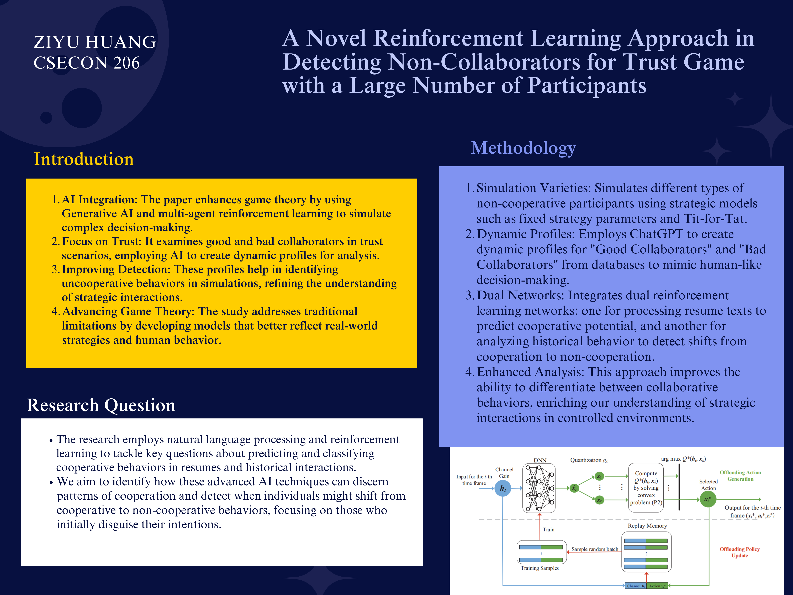

Poster: https://www.canva.com/design/DAGDtSopvt8/s0TPi9EDdkkCXThMcPjmvw/edit?utm_content=DAGDtSopvt8&utm_campaign=designshare&utm_medium=link2&utm_source=sharebutton

Github: https://github.com/Rising-Stars-by-Sunshine/CSECON206_Ziyu

View_Overleaf: https://www.overleaf.com/read/gbrsrccjdymh#b580fd

# Summarize the Background/Motivation
Traditional game theory is principally concerned with the negotiations between people. Within the context of research, it faces challenges due to a lack of data and the difficulty of conducting experiments. Recently, generative AI (GAI) has illuminated the path to generating human-like decision-making processes. This could potentially provide convenience for experimental endeavors in traditional game theory.

Consider the example of the "good and bad collaborators" game, which is a variation of trust and reputation games without controls in place, the good collaborators tend to eventually exit the game. Currently, a prospective avenue for enhancement is to construct a system of mutual selection that fosters equitable cooperation. Nevertheless, an inherent concern arises from our inability to curb the production of fraudulent resumes—a problem traditionally mitigated by more stringent regulatory measures. 

To address this issue, I intend to incorporate GAI to model good and bad collaborators in different scenarios and utilize MARL to learn these results. We may first simulate various scenarios (like personal performance and skills), followed by employing Generative AI to create profiles for good and bad collaborators, all striving to succeed in a "good collaborator test." We can then appoint multiple agents to repeatedly execute the "good collaborator detection" tasks using these profiles and relay the outcomes back to the Generative AI for its learning process. Ultimately, we aspire to decipher the conduct paradigms of uncooperative collaborators, which will assist in advancing game theory research in such contexts. 

# Research Questions
My research aims to address several crucial questions: How can natural language processing combined with reinforcement learning effectively predict and classify cooperative behaviors in generated resumes? Can a model that analyzes historical interaction patterns accurately predict the transition from cooperative to non-cooperative behaviors over time? And what are the key indicators in textual and behavioral data that distinguish good collaborators from bad collaborators, particularly those who initially disguise their intentions? These questions are significant because accurately predicting and understanding cooperative behaviors can lead to more effective team formations, enhance AI-human interactions, and ensure safety in trust-critical contexts. Traditional game theory literature, which often focuses on static scenarios with fixed strategies and lacks empirical data, does not sufficiently address these dynamic and complex behavior patterns, nor does it incorporate advanced AI technologies like natural language processing and machine learning. Our research seeks to fill these gaps by using modern AI techniques to provide a dynamic, context-sensitive analysis of cooperative behaviors, potentially enhancing both theoretical and practical applications in game theory and related fields.

# Application Scenario
The proposed solution, leveraging natural language processing and reinforcement learning to predict and classify cooperative behaviors, is applicable in various real-world scenarios, such as corporate human resources for analyzing potential hires' resume, social robots and virtual assistants for improving interactions with humans, and autonomous vehicles to predict human drivers' behaviors for safer and more efficient decision-making. To ground our approach in behavioral science, we can draw from psychological theories such as Social Exchange Theory, which analyzes relationships through cost-benefit analysis; Theory of Planned Behavior, which links intentions to attitudes, norms, and perceived control; Cognitive Dissonance Theory, explaining behavior contrary to beliefs due to social pressures; and research on trust and reciprocity, crucial for understanding the dynamics of cooperation. Integrating these psychological insights with our AI-driven methods will enhance our model’s predictive accuracy and deepen the interdisciplinary connection between AI, game theory, and psychology, thus providing a robust foundation for applying game theoretical concepts in practical, impactful ways.

# Methodology
In the study, we aim to simulate different types of non-cooperative participants such as completely uncooperative actors, occasionally cooperative participants, and gradual defectors, using various strategic models like fixed strategy parameters and Tit-for-Tat. Additionally, we are utilizing ChatGPT to generate dynamic profiles of "Good Collaborators" and "Bad Collaborators" from constructed databases, facilitating the simulation of human-like decision-making processes. Our model incorporates dual reinforcement learning networks: a language information learning network that processes resume texts to identify potential cooperative behaviors, and a historical information learning network that analyzes behavior over time to detect shifts from cooperation to non-cooperation. This multifaceted approach enhances our ability to distinguish between different collaborative behaviors, providing deeper insights into strategic interactions and decision-making processes in controlled settings.

# Preliminary Results
By better predicting and understanding these trust dynamics, our method can contribute to human welfare by improving mechanisms in environments where trust is critical, such as online marketplaces or collaborative platforms. This not only helps in designing better systems that encourage fair play and cooperation but also in creating strategies to mitigate risks associated with untrustworthy behaviors. Thus, our research offers substantial advancements in how trust-based interactions are modeled and managed, leading to more robust and effective cooperation in various social and economic settings.

# Intellectual Merits and Practical impacts of your project

The intellectual merits of my project lie in its innovative use of Generative AI and multi-agent reinforcement learning to model and analyze complex trust dynamics, significantly enhancing our understanding of strategic scenarios in social and economic contexts. However, a limitation is that our current approach primarily focuses on trust dynamics and may not fully address other aspects of human welfare, such as emotional intelligence and ethical considerations, which are also crucial in decision-making processes. This gap highlights an avenue for future research to integrate these elements into our models, providing a more holistic view of human interactions.
