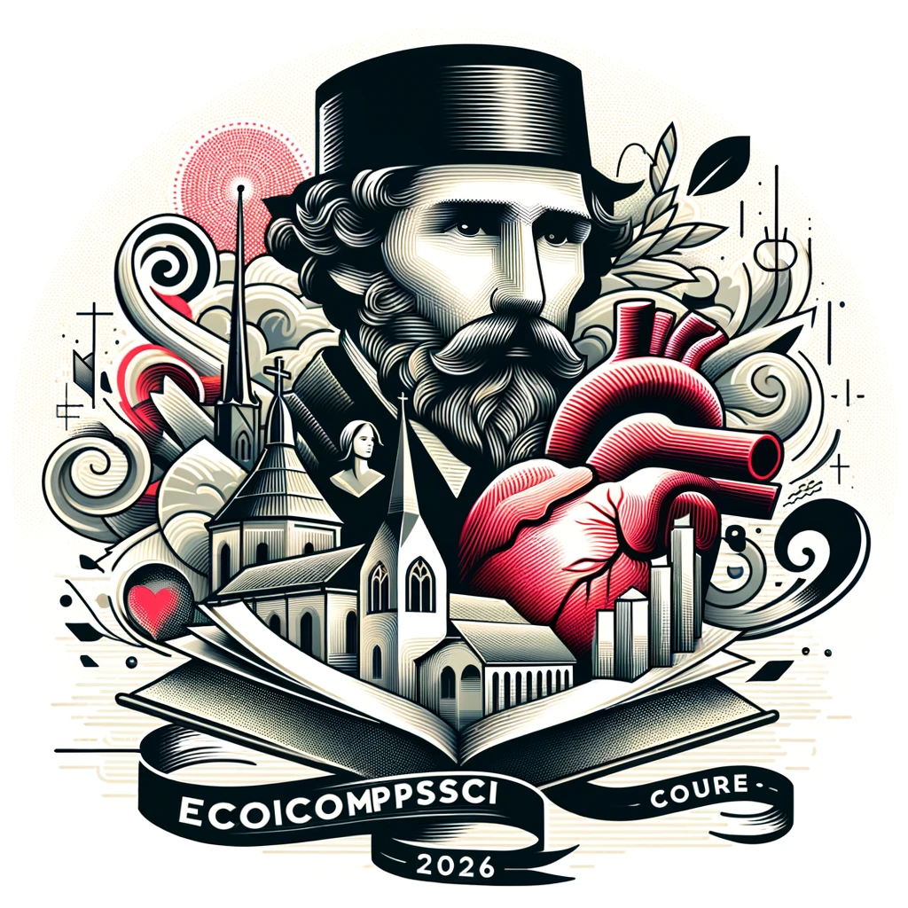

# CSECON206_Ziyu

# Short Bio
Hi all, I'm Ziyu Huang from China, junior student in Data Science. I've always thought economics to be an interesting subject, as I view it, its essential focus is on every individual in our society, endeavoring to accurately depict how they act and make decisions, particularly in the realms of trade and collaboration. This stands quite apart from Computer Science's pure mathematics and technical engineering focus. However, there are lots of CS applications can provide precise tools for quantitative analysis and forecasting for economics. I think this connection is my primary motivation for enrolling in this course. I expect this course will provide me with more interdisciplinary background, as well as introducing me to some new research methodologies or algorithms.

# Professional Profile
### Intellectual growth:

In this course, I leaned how advanced technologies like Generative AI (GAI), game theory, and multi-agent reinforcement learning (MARL) can address social and economic challenges. I have learn to model complex human behaviors and strategic interactions, enhancing problem-solving strategies in real-world scenarios. The magic of interdisciplinary research lies in its capacity to integrate diverse fields—merging AI with social sciences enriches our tools and approaches, leading to innovative, effective solutions. By understanding and applying these interdisciplinary methods, I not only gain a deeper insight into machine learning's potential but also its practical implications for societal benefits.

### Professional growth:

In this course, I have acquired numerous valuable tools, such as GitHub and Overleaf, which will greatly facilitate future collaborations with others. Learning to use these tools proficiently not only enhances my technical skill set but also prepares me to engage effectively in diverse team environments and multi-disciplinary projects, ensuring smooth and productive collaboration.

### Living a purposeful life: 

In terms of my personal views on the interdisciplinary research of computer science and economics, the study of generative AI is indeed a current popular area, and I firmly believe that this technology will eventually achieve recognition through awards like the Nobel Prize or the Turing Award. Yet evidently, it should not remain solely within the scientific domain. I assert that there is significant potential for a deep investigation into its implications for human society. I have observed that many papers in the field of economics have begun to explore how generative AI can imitate human decision-making processes and contribute to the advancement of game theory-related research. Nevertheless, there is currently a scant focus on how generative AI could revolutionize human cognitive processes and aid in a more profound self-comprehension.

My inspiration came from a paper by Takeshi and colleagues titled "Large Language Models are Zero-Shot Reasoners.". They discuss "chain of thought," a model of multi-step logical reasoning, which they used to assess the efficacy of ChatGPT. This sparked an epiphany for me due to a sudden connection I made with my own usage of ChatGPT. I had once envisaged it as a solution for all problems encountered in daily life, but my attempts ultimately met with failure. Upon reflecting on these unsuccessful endeavors, I recognized that my thought process is often nonlinear and that while analyzing issues, I could be influenced by many irrelevant factors that obscure the fundamental problem at hand. This bottleneck could be one of the reasons for ChatGPT's less-than-universal acceptance and might also explain the current surge in people investing efforts into the development of ChatGPT templates.

# Table of Contents
[CSEcon](https://github.com/Rising-Stars-by-Sunshine/CSECON206_Ziyu/tree/main/CSEcon)

[Advance_CSEcon](https://github.com/Rising-Stars-by-Sunshine/CSECON206_Ziyu/tree/main/Advance_CSEcon)

[Final Proposal](https://github.com/Rising-Stars-by-Sunshine/CSECON206_Ziyu/tree/main/Proposal%20(new))
